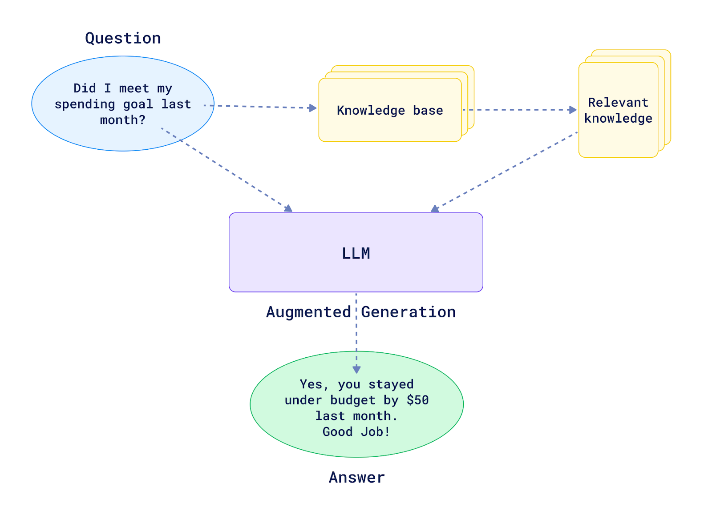

# 01-intro Notes

### What is RAG? 



[Source](https://qdrant.tech/articles/what-is-rag-in-ai/)

The original paper: [Link](https://arxiv.org/pdf/2005.11401)


### Configuring environment

1. Create env. & install packages

```bash
conda create --name llm_zoomcamp python=3.10.8
conda activate llm_zoomcamp
```

```bash
pip install tqdm notebook==7.1.2 openai elasticsearch pandas scikit-learn
```

2. LLM API key (Mistral in my case)

    - Register at **mistral ai**. Get 5$ for free trial  
    - Create API key
    - Export it as an environment variable and install Mistral Client:
    
    ```bash
    echo "export MISTRAL_API_KEY=[YOUR_KEY] >> ~/.baschrc" 
    source ~/.baschrc

    pip install mistralai
    ```

### Retrieval and Search

Run `parse-faq.ipynb` to download FAQ docs and store them as `documents.json` file.

Already implemented search algorithm is written in `minsearch.py` script which uses TF-IDF and cosine similarity to retrieve relevant info.

Another option is to use [**Elastic Search**](https://github.com/elastic/elasticsearch). You can run it with docker. 

### Generation

Given a *query*, we run our search algorithm to find the relevant the documents *search_results*. Then, we construct a prompt for LLM: 

```python
prompt_template = """
    You're a course teaching assistant. Answer the QUESTION based on the CONTEXT from the FAQ database.
    Use only the facts from the CONTEXT when answering the QUESTION.
    
    QUESTION: {query}
    
    CONTEXT: 
    {search_results}
    """
```

In case of Mistral, we send this prompt to LLM as follows:

```python

from mistralai.client import MistralClient
from mistralai.models.chat_completion import ChatMessage

client = MistralClient(api_key=api_key)

def llm(prompt):
    response = client.chat(
        model='open-mistral-7b',
        messages=[
            ChatMessage(role="user", content=prompt)
        ]
    )

    return response.choices[0].message.content

```


Overall our pipeline looks as follows:

```python
def rag(query):
    search_results = search_function(query)
    prompt = build_prompt(query, search_results)
    answer = llm(prompt)
    return answer

```


> Note: This is high-level description. See the `rag-intro.ipynb` for details 